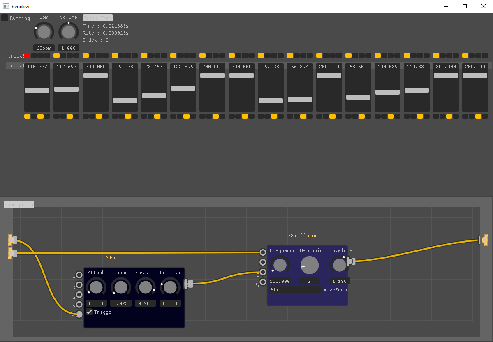

# Bendow

Bendow is and experimental nodal based synthesizer and sequencer

Bendow is developed and tested on Windows (Windows 10 Pro) and on MacBookPro M1 (MacOs Monterey 12.3.1)

# How to build
1. clone and build glfw
2. clone STK repository with submodule
3. change StkFloat from double to float in Stk.h
4. add `#define _USE_MATH_DEFINES` at the top of Stk.h
5. create a build folder inside Bendow folder
6. from this build repo run
    - cmake -DGLFW_DIR=path_to_glfw_build -DSTK_DIR=path_to_stk_submodule ../
    - cmake --build . --config Release

# Open sources projects
https://github.com/thestk/stk

